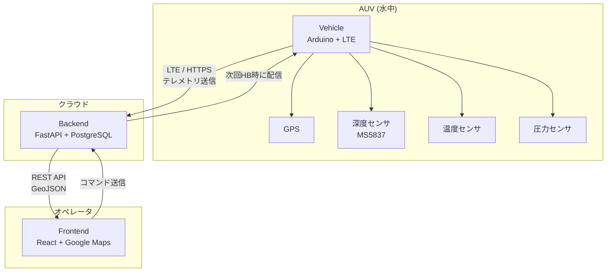
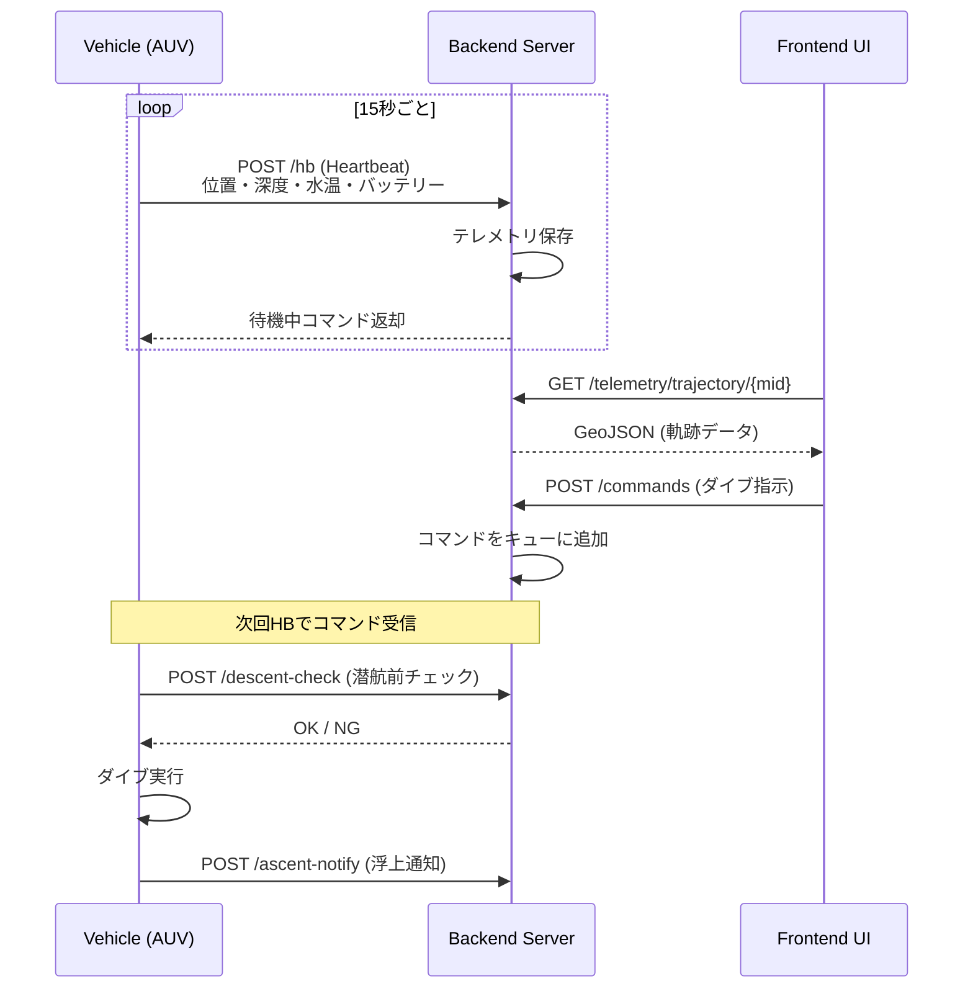

# Triton-4 Systems

Triton-4 AUV（自律型水中ロボット）の統合モニタリング・制御システムです。

## システム概要

本システムは、水中ロボット（AUV）のリアルタイム監視と遠隔制御を実現するための 3 つのコンポーネントで構成されています。



## コンポーネント

| ディレクトリ | 説明                         | 技術スタック                            |
| ------------ | ---------------------------- | --------------------------------------- |
| `vehicle/`   | AUV 搭載ファームウェア       | Arduino, LTE (SORACOM), GPS, MS5837     |
| `backend/`   | テレメトリ収集・API サーバー | Python, FastAPI, SQLAlchemy, PostgreSQL |
| `frontend/`  | Web モニタリング UI          | React, Vite, Tailwind CSS, Google Maps  |

## データフロー



## Vehicle（AUV ファームウェア）

Arduino ベースの組込みシステム。LTE 経由でテレメトリを送信し、サーバーからのコマンドを受信します。

### 主要機能

- **センサーデータ収集**: GPS、水圧（深度）、水温、内部圧力
- **LTE 通信**: SORACOM 経由で HTTPS POST
- **バルブ制御**: 潜航・浮上のための給排気バルブ自動制御
- **SD カードロギング**: オフラインデータ保存
- **IR リモコン**: モード切替（待機/センシング）

### ハードウェア構成

| コンポーネント | 型番 / 説明          |
| -------------- | -------------------- |
| マイコン       | Arduino (ATmega328P) |
| LTE モデム     | SARA (SORACOM 対応)  |
| 深度センサ     | MS5837-30BA          |
| GPS            | TinyGPS++ 互換       |
| RTC            | RX8025NB             |
| 表示           | LCD 16x2 (I2C)       |

## Backend（API サーバー）

FastAPI ベースの REST API サーバー。テレメトリデータの収集・保存と Web UI への配信を行います。

### セットアップ

```bash
cd backend
cp .env.example .env
docker compose up -d --build
```

### 主要エンドポイント

| エンドポイント                       | メソッド | 説明                          |
| ------------------------------------ | -------- | ----------------------------- |
| `/hb`                                | POST     | Vehicle からの Heartbeat 受信 |
| `/descent-check`                     | POST     | 潜航前チェック                |
| `/ascent-notify`                     | POST     | 浮上完了通知                  |
| `/api/v1/devices`                    | GET      | デバイス一覧                  |
| `/api/v1/telemetry/trajectory/{mid}` | GET      | GPS 軌跡 (GeoJSON)            |
| `/api/v1/telemetry/latest/{mid}`     | GET      | 最新テレメトリ                |
| `/api/v1/commands`                   | POST     | コマンド送信                  |
| `/api/v1/dives`                      | GET      | ダイブ履歴                    |

詳細: [backend/README.md](./backend/README.md)

## Frontend（Web UI）

React ベースのモニタリングダッシュボード。Google Maps 上にリアルタイムで AUV の位置と軌跡を表示します。

### セットアップ

```bash
cd frontend
npm install
npm run dev
```

### 主要機能

- **リアルタイムマップ**: GPS 軌跡の可視化
- **テレメトリパネル**: 深度、水温、バッテリー、信号強度
- **コマンド送信**: ダイブ指示の発行
- **自動追従**: 最新位置への自動パン

詳細: [frontend/README.md](./frontend/README.md)

## 開発環境

### 必要なソフトウェア

- **Backend**: Python 3.11+, Docker, Docker Compose
- **Frontend**: Node.js 18+, npm
- **Vehicle**: Arduino IDE, 必要なライブラリ

### クイックスタート

```bash
# Backend 起動
cd backend && docker compose up -d --build

# Frontend 起動
cd frontend && npm install && npm run dev
```
