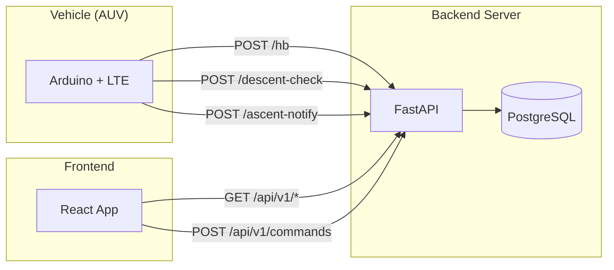
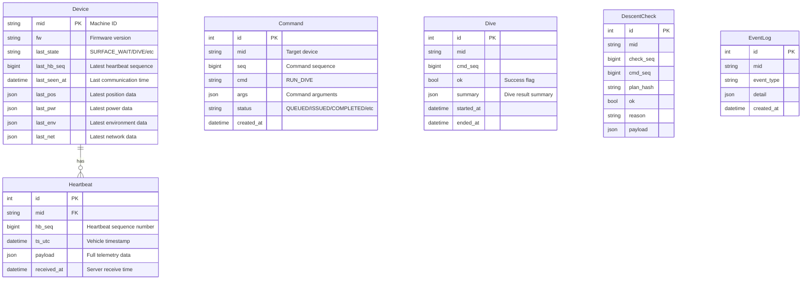
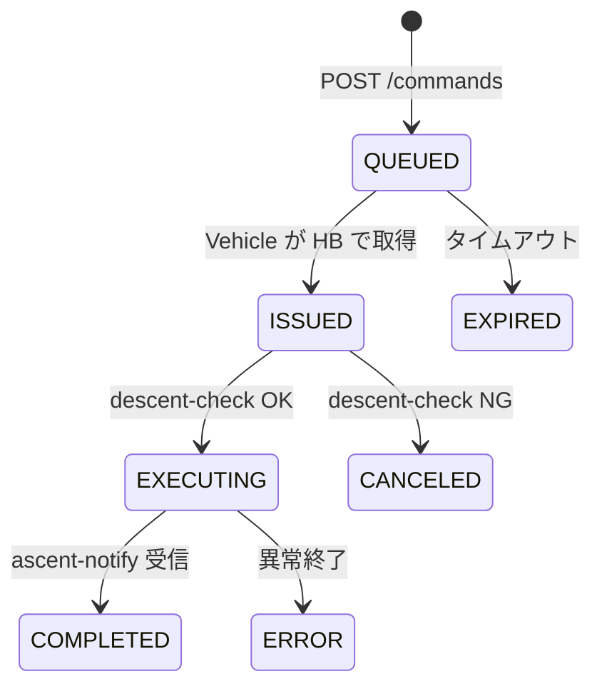

# Triton-4 COM Server

Triton-4 AUV（自律型水中ロボット）のテレメトリ収集・コマンド配信を行うバックエンドサーバーです。

## システム概要



## 機能

- **テレメトリ収集**: Vehicle からの Heartbeat を受信・保存
- **コマンド配信**: Web UI からのコマンドを Vehicle に配信
- **ダイブ管理**: 潜航前チェック、浮上通知の処理
- **REST API**: GeoJSON 形式の軌跡データ、デバイス状態の提供

## 技術スタック

| カテゴリ | 技術 |
|---|---|
| フレームワーク | FastAPI |
| ORM | SQLAlchemy 2.0 (async) |
| データベース | PostgreSQL (本番) / SQLite (開発) |
| マイグレーション | Alembic |
| ロギング | structlog |
| コンテナ | Docker / Docker Compose |

## プロジェクト構成

```
backend/
├── docker-compose.yml    # Docker Compose 設定
├── Dockerfile            # コンテナイメージ定義
├── .env.example          # 環境変数テンプレート
└── server/
    ├── app/
    │   ├── main.py           # FastAPI アプリケーション
    │   ├── database.py       # DB 接続設定
    │   ├── models.py         # SQLAlchemy モデル
    │   ├── schemas.py        # Vehicle API スキーマ
    │   ├── web_schemas.py    # Web API スキーマ
    │   └── routers/
    │       ├── hb.py             # Heartbeat エンドポイント
    │       ├── descent.py        # 潜航チェック
    │       ├── ascent.py         # 浮上通知
    │       ├── web_devices.py    # デバイス管理 API
    │       ├── web_commands.py   # コマンド管理 API
    │       ├── web_telemetry.py  # テレメトリ API
    │       ├── web_dives.py      # ダイブ履歴 API
    │       └── web_events.py     # イベントログ API
    ├── cli.py                # CLI ツール
    ├── requirements.txt      # Python 依存関係
    └── migrations/           # Alembic マイグレーション
```

## データベーススキーマ



## API エンドポイント

### Vehicle 通信 API

Vehicle（AUV）との直接通信用エンドポイント。

| エンドポイント | メソッド | 説明 |
|---|---|---|
| `/hb` | POST | Heartbeat 受信。テレメトリを保存し、待機中コマンドを返却 |
| `/descent-check` | POST | 潜航前チェック。計画を検証し OK/NG を返却 |
| `/ascent-notify` | POST | 浮上完了通知。ダイブ結果を記録 |

### Web API (`/api/v1`)

Web UI およびサードパーティアプリ向け REST API。

#### デバイス管理

| エンドポイント | メソッド | 説明 |
|---|---|---|
| `/devices` | GET | デバイス一覧（ページネーション対応） |
| `/devices/{mid}` | GET | デバイス詳細（最新テレメトリ含む） |
| `/devices/{mid}/status` | GET | デバイス状態（軽量版） |

#### コマンド管理

| エンドポイント | メソッド | 説明 |
|---|---|---|
| `/commands` | POST | コマンド送信（RUN_DIVE） |
| `/commands` | GET | コマンド一覧 |
| `/commands/{id}` | GET | コマンド詳細 |

**コマンド送信例:**
```json
{
  "mid": "TR4-001",
  "cmd": "RUN_DIVE",
  "args": {
    "target_depth_m": 50,
    "hold_at_depth_s": 60,
    "cycles": 1
  }
}
```

#### テレメトリ

| エンドポイント | メソッド | 説明 |
|---|---|---|
| `/telemetry/latest/{mid}` | GET | 最新テレメトリ |
| `/telemetry/heartbeats` | GET | Heartbeat 履歴 |
| `/telemetry/trajectory/{mid}` | GET | GPS 軌跡（GeoJSON / detailed） |

**GeoJSON レスポンス例:**
```json
{
  "type": "FeatureCollection",
  "features": [
    {
      "type": "Feature",
      "geometry": {
        "type": "LineString",
        "coordinates": [[135.142, 34.670, 0], ...]
      },
      "properties": {
        "mid": "TR4-001",
        "total_distance_m": 1234.5
      }
    }
  ]
}
```

#### ダイブ・イベント

| エンドポイント | メソッド | 説明 |
|---|---|---|
| `/dives` | GET | ダイブ履歴 |
| `/dives/{id}` | GET | ダイブ詳細 |
| `/events` | GET | イベントログ |

### ユーティリティ

| エンドポイント | メソッド | 説明 |
|---|---|---|
| `/health` | GET | ヘルスチェック（DB 接続確認） |
| `/admin/reset-db` | POST | データベースリセット（開発用） |

## セットアップ

### 環境変数

| 変数名 | 説明 | デフォルト |
|---|---|---|
| `DATABASE_URL` | DB 接続文字列 | `postgresql+asyncpg://...` |
| `POSTGRES_DB` | データベース名 | `triton_com` |
| `POSTGRES_USER` | DB ユーザー | `triton` |
| `POSTGRES_PASSWORD` | DB パスワード | - |
| `LOG_LEVEL` | ログレベル | `INFO` |

### Docker での起動（推奨）

```bash
# 環境変数を設定
cp .env.example .env
vim .env  # パスワードを設定

# コンテナをビルド・起動
docker compose up -d --build

# ログを確認
docker compose logs -f server

# 停止
docker compose down
```

### ローカル開発

```bash
cd server

# 仮想環境を作成
python -m venv venv
source venv/bin/activate  # Windows: venv\Scripts\activate

# 依存関係をインストール
pip install -r requirements.txt

# SQLite で起動（開発用）
DATABASE_URL=sqlite+aiosqlite:///./triton_com.db \
  uvicorn app.main:app --reload --host 0.0.0.0 --port 8000
```

### データベース操作

```bash
# データベースリセット（Docker 環境）
docker compose exec server python3 /app/server/cli.py reset-db

# バックアップ（PostgreSQL）
docker compose exec db pg_dump -U triton triton_com > backup.sql
```

## API ドキュメント

サーバー起動後、以下の URL で対話的なドキュメントにアクセス可能：

- **Swagger UI**: http://localhost:8000/api/v1/docs
- **ReDoc**: http://localhost:8000/api/v1/redoc
- **OpenAPI JSON**: http://localhost:8000/api/v1/openapi.json

## コマンドライフサイクル



## ライセンス

MIT
