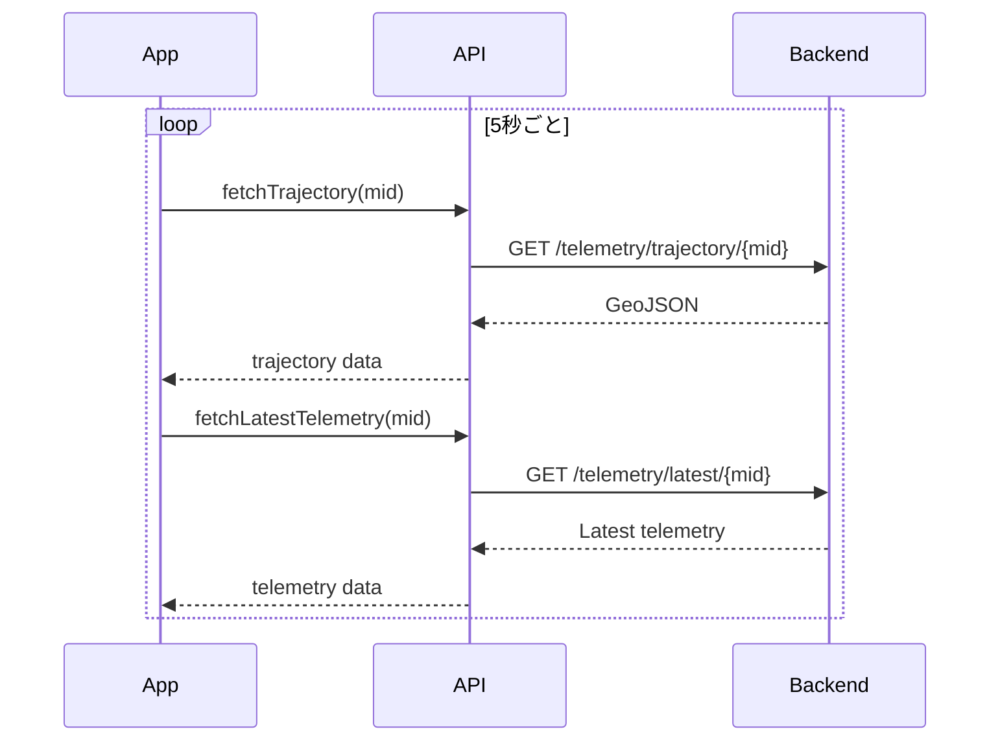

# Triton-4 Overwatch - Frontend

Triton-4 AUV（自律型水中ロボット）のリアルタイムモニタリング・制御用 Web アプリケーションです。

## 機能

- **リアルタイムマップ**: GPS 軌跡の可視化（5 秒間隔で自動更新）
- **テレメトリパネル**: 深度、水温、バッテリー、LTE 信号強度の表示
- **自動追従モード**: 最新位置に自動でマップをパン
- **履歴参照**: 軌跡上のポイントをクリックして過去のデータを表示
- **コマンド送信**: ダイブ指示の発行

## 技術スタック

| カテゴリ          | 技術                       |
| ----------------- | -------------------------- |
| フレームワーク    | React 19                   |
| ビルドツール      | Vite                       |
| スタイリング      | Tailwind CSS               |
| 地図              | Google Maps JavaScript API |
| HTTP クライアント | Axios                      |
| アイコン          | Lucide React               |

## コンポーネント構成

```mermaid
graph TB
    subgraph "App.jsx"
        App[App]
    end

    subgraph "Layout"
        Layout[Layout]
        Header[Header]
    end

    subgraph "Main Components"
        Map[MapComponent]
        Info[MachineInfoPanel]
    end

    subgraph "API Layer"
        API[api.js]
    end

    App --> Layout
    Layout --> Header
    Layout --> Map
    Layout --> Info
    Map --> API
    Info --> API
```

## プロジェクト構成

```
frontend/
├── index.html            # エントリー HTML
├── package.json          # 依存関係
├── vite.config.js        # Vite 設定
├── tailwind.config.js    # Tailwind 設定
├── postcss.config.js     # PostCSS 設定
├── eslint.config.js      # ESLint 設定
├── vercel.json           # Vercel デプロイ設定
├── public/
│   └── vite.svg
└── src/
    ├── main.jsx          # React エントリーポイント
    ├── App.jsx           # メインアプリケーション
    ├── App.css           # グローバルスタイル
    ├── index.css         # Tailwind インポート
    ├── api.js            # API クライアント
    └── components/
        ├── Layout.jsx           # レイアウトラッパー
        ├── Header.jsx           # ヘッダー（接続状態表示）
        ├── MapComponent.jsx     # Google Maps 表示
        ├── MachineInfoPanel.jsx # テレメトリパネル
        └── DataPanel.jsx        # データ表示パネル
```

## コンポーネント詳細

### App.jsx

メインアプリケーションコンポーネント。状態管理とデータフェッチを担当。

```jsx
// 主要な状態
const [trajectory, setTrajectory] = useState(null); // GeoJSON 軌跡
const [latestTelemetry, setLatestTelemetry] = useState(null); // 最新データ
const [selectedPoint, setSelectedPoint] = useState(null); // 選択ポイント
const [isTracking, setIsTracking] = useState(true); // 追従モード
```

**データ更新フロー:**



### MapComponent.jsx

Google Maps 上に AUV の軌跡と現在位置を表示。

**主要機能:**

- 軌跡の Polyline 描画
- ポイントマーカーの表示
- クリックイベントでのポイント選択
- 追従モードでの自動パン

### MachineInfoPanel.jsx

選択されたポイントまたは最新のテレメトリデータを表示。

**表示項目:**
| 項目 | 説明 | 単位 |
|---|---|---|
| 深度 | 水圧センサから算出 | m |
| 水温 | 外部温度センサ | ℃ |
| SOC | バッテリー残量 | % |
| 電圧 | バッテリー電圧 | V |
| RSRP | LTE 信号強度 | dBm |
| 衛星数 | GPS 捕捉衛星数 | - |

### Header.jsx

接続状態、デバイス ID、最終更新時刻を表示。

## API クライアント

`src/api.js` で Backend との通信を管理。

```javascript
// 利用可能な関数
fetchTrajectory(mid); // GPS 軌跡（GeoJSON）
fetchLatestTelemetry(mid); // 最新テレメトリ
sendCommand(mid, cmd, args); // コマンド送信
resetDatabase(); // DB リセット（開発用）
```

## セットアップ

### 環境変数

`.env` ファイルを作成:

```bash
# Backend API URL
VITE_API_BASE_URL=http://localhost:8000/api/v1

# Google Maps API キー
VITE_GOOGLE_MAPS_API_KEY=your_google_maps_api_key

# デフォルトの Machine ID
VITE_TRITON_MID=TR4-001
```

| 変数名                     | 説明                    | 必須 |
| -------------------------- | ----------------------- | ---- |
| `VITE_API_BASE_URL`        | Backend API の URL      | ○    |
| `VITE_GOOGLE_MAPS_API_KEY` | Google Maps API キー    | ○    |
| `VITE_TRITON_MID`          | デフォルトの Machine ID | -    |

### 依存関係のインストール

```bash
npm install
```

### 開発サーバーの起動

```bash
npm run dev
# http://localhost:5173 でアクセス可能
```

### 本番ビルド

```bash
# ビルド
npm run build

# ビルド結果のプレビュー
npm run preview
```

### リント

```bash
npm run lint
```

## デプロイ

### Vercel

`vercel.json` が設定済み。GitHub リポジトリを Vercel に接続すると自動デプロイ。

```json
{
  "rewrites": [
    {
      "source": "/api/:path*",
      "destination": "https://your-backend-url/api/:path*"
    }
  ]
}
```

### 手動デプロイ

```bash
npm run build
# dist/ フォルダを任意の静的ホスティングにデプロイ
```

## 開発ガイド

### 新しいテレメトリ項目の追加

1. `MachineInfoPanel.jsx` に表示ロジックを追加
2. Backend からのレスポンスに対応するフィールドをマッピング

### スタイリング

Tailwind CSS のユーティリティクラスを使用:

```jsx
<div className="bg-slate-800 rounded-lg p-4 shadow-lg">
  <span className="text-cyan-400 font-mono">{value}</span>
</div>
```

### 地図のカスタマイズ

`MapComponent.jsx` の `mapOptions` を編集:

```javascript
const mapOptions = {
  mapTypeId: 'satellite',  // satellite / roadmap / terrain / hybrid
  styles: [...],           // カスタムスタイル
  disableDefaultUI: true,  // デフォルト UI 非表示
};
```

## ライセンス

MIT
