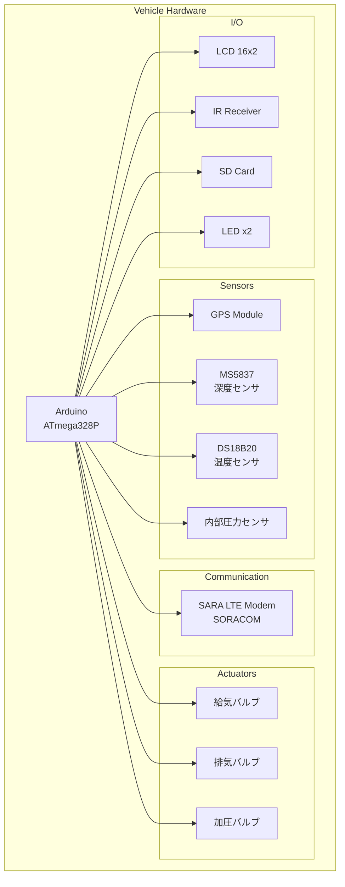
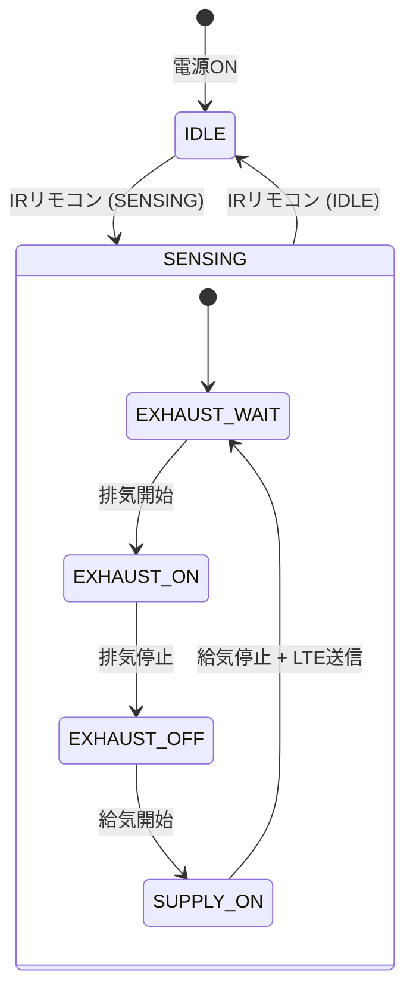

# Triton-4 Vehicle Firmware

Triton-4 AUV（自律型水中ロボット）の組込みファームウェアです。Arduino ベースで動作し、LTE 経由でサーバーと通信します。

## システム概要



## 機能

- **センサーデータ収集**: GPS 位置、水深、水温、内部圧力
- **LTE テレメトリ送信**: SORACOM 経由で HTTPS POST
- **自動潜航制御**: バルブ制御による潜航・浮上サイクル
- **SD カードロギング**: オフラインデータ保存
- **IR リモコン制御**: モード切替（待機/センシング）

## ハードウェア構成

### メインボード

| コンポーネント | 型番 / 仕様 | 接続 |
|---|---|---|
| マイコン | Arduino (ATmega328P) | - |
| LTE モデム | SARA R4 series | SoftwareSerial (A6, A7) |
| GPS | TinyGPS++ 互換 | SoftwareSerial (D2, D3) |
| RTC | RX8025NB | I2C |
| LCD | 16x2 Character LCD | I2C (0x27) |

### センサー

| センサー | 型番 | 接続 | 用途 |
|---|---|---|---|
| 深度センサ | MS5837-30BA | I2C | 水深・外部水温計測 |
| 温度センサ | DS18B20 | OneWire (D4) | 内部温度計測 |
| 圧力センサ | アナログ | A3 | 内部圧力監視 |

### アクチュエータ

| バルブ | ピン | 機能 |
|---|---|---|
| V1 (給気) | D7 | 浮力タンクへの空気供給 |
| V2 (排気) | D6 | 浮力タンクからの空気排出 |
| V3 (加圧) | D5 | 内部圧力調整 |

### その他

| デバイス | ピン | 機能 |
|---|---|---|
| SD カード | D10 (CS) | データロギング |
| 緑 LED | D9 | センシングモード表示 |
| 赤 LED | D8 | 待機モード表示 |
| IR 受信 | D14 (A0) | リモコン受信 |

## ピン配置

```
Arduino Nano / Uno
─────────────────────────────────
D0  (RX)  - (未使用)
D1  (TX)  - (未使用)
D2        - GPS RX (SoftwareSerial)
D3        - GPS TX (SoftwareSerial)
D4        - OneWire (DS18B20)
D5        - V3 加圧バルブ
D6        - V2 排気バルブ
D7        - V1 給気バルブ
D8        - 赤 LED
D9        - 緑 LED
D10       - SD Card CS
D11       - SD Card MOSI
D12       - SD Card MISO
D13       - SD Card SCK

A0 (D14)  - IR Receiver
A3        - 内部圧力センサ
A4 (SDA)  - I2C Data
A5 (SCL)  - I2C Clock
A6        - LTE Modem RX
A7        - LTE Modem TX
```

## 動作モード

### 状態遷移図



### IDLE モード

- 赤 LED 点灯
- センサー読み取り停止
- IR コマンド待機

### SENSING モード

- 緑 LED 点灯
- センサーデータを継続的に収集
- バルブ制御による潜航/浮上サイクル実行
- SD カードにログ保存
- サイクル完了時に LTE でデータ送信

## 設定パラメータ

```cpp
struct {
  uint32_t supplyStartDelayMs  = 10000;   // 給気開始までの待機時間
  uint32_t supplyStopDelayMs   = 5000;    // 給気継続時間
  uint32_t exhaustStartDelayMs = 30000;   // 排気開始までの待機時間
  uint32_t exhaustStopDelayMs  = 30000;   // 排気継続時間
  uint8_t  lcdMode             = 0;       // LCD 表示モード
  uint8_t  logMode             = 2;       // ログモード
  uint16_t diveCount           = 0;       // ダイブ回数制限 (0=無制限)
  uint16_t inPressThresh       = 5;       // 内部圧力閾値
} cfg;
```

## LTE 通信

### 接続設定

| パラメータ | 値 |
|---|---|
| APN | `soracom.io` |
| 認証 | CHAP (sora/sora) |
| プロトコル | HTTPS POST |
| Content-Type | application/json |

### 送信データ形式

```json
{
  "DataType": "HK",
  "MachineID": "NANO001",
  "MachineTime": "2025/06/15 12:30:45",
  "GPS": {
    "LAT": 34.670361,
    "LNG": 135.142520,
    "ALT": 0,
    "SAT": 9
  },
  "BAT": "N/A",
  "SENSOR": {
    "DEPTH": 25.3,
    "PRESSURE_INT": 1050.5,
    "PRESSURE_EXT": 1350.2,
    "TEMP_WATER": 18.5,
    "TEMP_BODY": 25.0
  },
  "CMT": "MODE:NORMAL,GPS_ERROR:OK,SD_ERROR:OK,LTE_ERROR:N/A,RSSI:+CSQ:15,99"
}
```

## 必要なライブラリ

Arduino IDE のライブラリマネージャからインストール:

| ライブラリ | バージョン | 用途 |
|---|---|---|
| TinyGPS++ | latest | GPS パース |
| MS5837 | latest | 深度センサ |
| DallasTemperature | latest | 温度センサ |
| OneWire | latest | DS18B20 通信 |
| RTC_RX8025NB | latest | RTC 制御 |
| IRremote | latest | IR 受信 |
| LiquidCrystal_I2C | latest | LCD 制御 |
| SD | built-in | SD カード |
| TimeLib | latest | 時刻処理 |

## ビルド & 書き込み

### Arduino IDE

1. `vehicle.ino` を Arduino IDE で開く
2. 必要なライブラリをインストール
3. ボードを選択 (Arduino Nano / Uno)
4. シリアルポートを選択
5. 書き込み

### PlatformIO (オプション)

```ini
[env:nano]
platform = atmelavr
board = nanoatmega328
framework = arduino

lib_deps =
    mikalhart/TinyGPSPlus
    bluerobotics/BlueRobotics MS5837 Library
    paulstoffregen/OneWire
    milesburton/DallasTemperature
    arduino-libraries/SD
    paulstoffregen/Time
    z3t0/IRremote
    marcoschwartz/LiquidCrystal_I2C
```

## デバッグ

シリアルモニタ (9600 baud) でログを確認:

```
[STATE] Received command: RUN_DIVE (Seq: 1)
[STATE] Transitioning to: DESCENT_CHECK
exh start
exh stop
sup start
[JSON Data]
{"DataType":"HK",...}
--> AT+CSQ
<<- RSSI=+CSQ:15,99
sup stop
```

## トラブルシューティング

| 症状 | 原因 | 対処 |
|---|---|---|
| SD FAILED | SD カード未挿入/破損 | SD カードを確認 |
| GPS 位置が 0.0 | GPS 衛星未捕捉 | 屋外で待機 |
| LTE TIMEOUT | 圏外/SIM 問題 | SORACOM コンソールで確認 |
| 深度 0 固定 | センサー未接続 | I2C 配線を確認 |

## ライセンス

MIT
